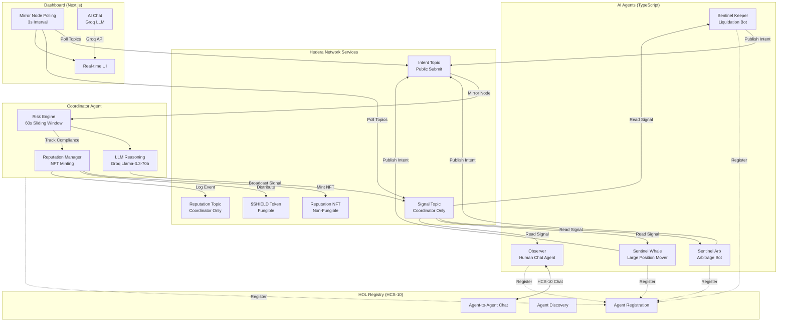
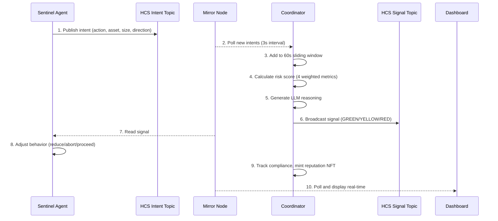

# AgentShield

**Decentralized DeFi Circuit Breaker Protocol via AI Agent Consensus on Hedera**

AgentShield is a pre-execution coordination layer where AI agents broadcast transaction intents via Hedera Consensus Service before executing. A Coordinator agent aggregates intents in real-time, detects cascading liquidation risk using weighted anomaly scoring and LLM reasoning, and broadcasts safety signals to all participating agents. Agents autonomously comply by adjusting trade sizes or aborting. All agents are registered in the Hashgraph Online Registry via HCS-10 for discovery and trustless communication.

Track: AI and Agents | Bounty: Hashgraph Online | Hedera Hello Future Apex Hackathon 2026

**[Demo Video](https://www.youtube.com/watch?v=50SCgqlaXqw)** | **[Live Dashboard (Vercel)](https://dashboard-sandy-delta-60.vercel.app)** | **[Live Backend (HF Spaces)](https://yeheskieltame-agentshield.hf.space/health)** | **[HOL Registry](https://moonscape.tech)** | **[HashScan Explorer](https://hashscan.io/testnet)**

## Table of Contents

1. [Problem](#problem)
2. [Solution](#solution)
3. [Architecture](#architecture)
4. [Hedera Integration](#hedera-integration)
5. [HOL Bounty Integration](#hol-bounty-integration)
6. [Tech Stack](#tech-stack)
7. [Project Structure](#project-structure)
8. [Quick Start](#quick-start)
9. [Testnet Deployment](#testnet-deployment)
10. [Risk Scoring Engine](#risk-scoring-engine)
11. [HCS Message Protocol](#hcs-message-protocol)
12. [Demo Scenarios](#demo-scenarios)
13. [Findings](#findings)
14. [Go-To-Market Strategy](#go-to-market-strategy)
15. [Roadmap](#roadmap)
16. [License](#license)

## Problem

On October 10-11, 2025, the crypto market experienced the largest liquidation cascade in history. USD 19 billion in leveraged positions were wiped out within hours. 1.7 million traders were affected. Bitcoin dropped 14 percent. Solana fell over 40 percent.

The root cause was structural, not fundamental:

- AI agents, liquidation bots, and keeper bots operate in isolation. Each optimizes for its own objective. When thousands simultaneously deleverage, a self-reinforcing doom loop forms.
- Traditional markets (NYSE, NASDAQ) halt trading at 7, 13, and 20 percent drops. Crypto has no equivalent coordinated circuit breaker.
- A USD 60 million oracle manipulation was amplified 300x into USD 19.3 billion in destruction because no coordination layer existed to detect the anomaly before cascade.
- DeFi protocols like Aave survived (liquidated USD 180M with zero bad debt) but could not prevent the cascade. They only endured the impact.

The missing piece: a trustless coordination layer where agents share intent before execution, enabling collective awareness of systemic risk.

Sources:
- insights4vc.substack.com/p/inside-the-19b-flash-crash
- hackernoon.com - What the October 2025 Flash Crash Taught Us
- soliduslabs.com - When Whales Whisper: Inside the 20 Billion Crypto Meltdown
- coindesk.com - Aave Sees Flash Crash as DeFi Protocol Endures Largest Stress Test

## Solution

AgentShield introduces a voluntary, decentralized circuit breaker with five steps:

1. AI agents broadcast their transaction intent to a shared HCS topic before executing
2. A Coordinator agent aggregates all intents in a sliding 60-second window and calculates a composite risk score using four weighted metrics
3. The Coordinator uses an LLM (Groq/Llama-3.3-70b) to generate natural language reasoning for each risk assessment
4. The Coordinator broadcasts a safety signal (GREEN, YELLOW, or RED) to all agents
5. Agents autonomously comply: proceed normally, reduce size by 50 percent, or abort entirely

No smart contract pauses. No centralized kill switches. Agents retain full autonomy while gaining collective intelligence about systemic risk.

## Architecture



### Data Flow



## Hedera Integration

AgentShield uses five Hedera native services with zero custom smart contracts:

| Service | Usage |
|---------|-------|
| HCS (Consensus Service) | Intent broadcast, signal broadcast, reputation logging. Three topics with different access controls. |
| HTS (Token Service) | SHIELD fungible token for rewards. Reputation NFT collection for compliance badges. |
| Account Service | Six agent accounts. HBAR transfers for funding. Token associations and transfers. |
| Mirror Node REST API | Real-time HCS message polling at 3-second intervals. Account and token data queries. |
| HCS-10 Standard | Agent registration, discovery, and bidirectional chat via Hashgraph Online Registry. |

Why no custom smart contract: HTS creates tokens natively without Solidity. HCS records immutable state without Solidity. HBAR transfers handle rewards without Solidity. Development time is focused on agent logic, which is the core innovation.

## HOL Bounty Integration

Bounty requirement: Register and build a useful AI Agent in the HOL Registry Broker.

| Requirement | Implementation |
|-------------|---------------|
| Register agent using HOL Standards SDK | All 5 agents registered via HCS10Client and AgentBuilder |
| Others can reach agent via HCS-10 | Each agent has inbound/outbound topics for bidirectional communication |
| Users can chat with agent using natural language | Observer Agent accepts HCS-10 messages and responds with risk status |
| Interface with Apex Hackathon dApp | Dashboard displays registered agents, shows risk data, enables AI chat |

HOL use cases addressed:
- Agents subscribing to other agents outputs: All Sentinels subscribe to Coordinator signals
- Agents competing for tasks: Sentinels compete for highest compliance score and reputation NFTs
- Agent DAOs / guilds / collectives: AgentShield is an agent collective for DeFi safety
- Agents hiring other agents: Coordinator delegates monitoring tasks to Sentinels

## Tech Stack

| Component | Technology |
|-----------|-----------|
| Language | TypeScript, Node.js, ES Modules |
| Blockchain | Hedera Testnet |
| Runtime LLM | Groq free tier, llama-3.3-70b-versatile |
| Agent Framework | LangChain, LangGraph |
| Hedera SDK | @hashgraph/sdk v2.81+ |
| HOL Standards | @hashgraphonline/standards-sdk v0.1.168+ |
| Agent Toolkit | hedera-agent-kit v3.8+ |
| Dashboard | Next.js 15, Tailwind CSS, Recharts |
| Runner | tsx (TypeScript Execute) |

## Project Structure

```
agentshield/
  agents/
    coordinator/
      index.ts                 Main loop: subscribe, aggregate, signal
      risk-engine.ts           Sliding window and cascade risk score
      llm-reasoning.ts         Groq LLM for human-readable explanation
      reputation-manager.ts    Compliance tracking, NFT minting, SHIELD distribution
    sentinel/
      index.ts                 Main loop: detect, broadcast intent, listen signal
      scenarios/
        flash-crash.ts         Simulates Oct 2025 cascade scenario
        whale-dump.ts          Large single-actor dump scenario
        normal-trading.ts      Normal market conditions baseline
    observer/
      index.ts                 HCS-10 chat agent with message handling
      chat-handler.ts          Natural language query to risk status response
  lib/
    config.ts                  Environment variables and constants
    hedera-client.ts           Hedera SDK client initialization
    hcs-subscriber.ts          Mirror Node HCS topic subscription
    types.ts                   TypeScript interfaces for all message types
  scripts/
    setup-topics.ts            Create 3 HCS topics
    create-tokens.ts           Create SHIELD token and Reputation NFT
    register-agents.ts         Register all agents in HOL Registry
    fund-agents.ts             Send test HBAR to all agent accounts
  dashboard/
    app/                       Next.js App Router pages
    components/                UI components (glassmorphism design)
    lib/                       Mirror Node client and data hooks
  docs/
    ARCHITECTURE.md            System architecture details
    SETUP.md                   Setup and installation guide
    DEMO-SCRIPT.md             Demo video script
```

## Quick Start

Prerequisites: Node.js 18+, 6 Hedera Testnet accounts, Groq API key.

```bash
git clone https://github.com/yeheskieltame/AgentShield.git
cd AgentShield
npm install
cd dashboard && npm install && cd ..
cp .env.example .env
# Fill in account IDs, private keys, and Groq API key

# Setup (run in order)
npx tsx scripts/setup-topics.ts       # Copy topic IDs to .env
npx tsx scripts/create-tokens.ts      # Copy token IDs to .env
npx tsx scripts/register-agents.ts    # Register in HOL Registry
npx tsx scripts/fund-agents.ts        # Fund agent accounts

# Run agents (each in its own terminal)
npm run coordinator                   # Must start first
npm run sentinel:keeper
npm run sentinel:arb
npm run sentinel:whale
npm run observer

# Run dashboard
cd dashboard && npm run dev           # Open http://localhost:3000
```

## Testnet Deployment

### Agent Operator Accounts

| Agent | Account ID | Role |
|-------|-----------|------|
| Coordinator | 0.0.7275085 | Risk aggregation and signal broadcast |
| Sentinel Keeper | 0.0.8268231 | Liquidation bot |
| Sentinel Arb | 0.0.8291404 | Arbitrage bot |
| Sentinel Whale | 0.0.8291411 | Large position mover |
| Observer | 0.0.8291431 | Human-facing chat agent |
| Treasury | 0.0.8291460 | Fund distribution |

### HOL Registry Agents

All 5 agents registered via HCS-10. Verify at moonscape.tech.

| Agent | HOL Account | Inbound Topic | Outbound Topic | Profile Topic | Registration TX |
|-------|------------|---------------|----------------|---------------|----------------|
| Coordinator | 0.0.8299709 | 0.0.8299711 | 0.0.8299710 | 0.0.8299713 | 0.0.2659396@1773992772.031475119 |
| Sentinel Keeper | 0.0.8299715 | 0.0.8299717 | 0.0.8299716 | 0.0.8299719 | 0.0.2659396@1773992873.484429300 |
| Sentinel Arb | 0.0.8299726 | 0.0.8299730 | 0.0.8299729 | 0.0.8299732 | 0.0.2659396@1773992942.594361605 |
| Sentinel Whale | 0.0.8299734 | 0.0.8299736 | 0.0.8299735 | 0.0.8299740 | 0.0.2659396@1773993057.429652056 |
| Observer | 0.0.8299742 | 0.0.8299746 | 0.0.8299745 | 0.0.8299748 | 0.0.2659396@1773993122.791638818 |

### HCS Topics

| Topic | ID | Purpose | Submit Key |
|-------|----|---------|------------|
| Intent | 0.0.8291524 | Agents broadcast transaction intents before execution | Public |
| Signal | 0.0.8291525 | Coordinator broadcasts GREEN/YELLOW/RED safety signals | Coordinator only |
| Reputation | 0.0.8291526 | Coordinator logs agent compliance and reputation events | Coordinator only |

### HTS Tokens

| Token | ID | Type | Supply |
|-------|----|------|--------|
| SHIELD | 0.0.8291529 | Fungible (8 decimals) | 100,000,000 |
| Reputation NFT | 0.0.8291530 | Non-Fungible (Infinite) | Minted on compliance milestones |

## Risk Scoring Engine

The Coordinator calculates a composite risk score (0.0 to 1.0) using a sliding 60-second window of all received intents.

### Scoring Formula

```
score = (0.30 x volume) + (0.25 x concentration) + (0.25 x sellPressure) + (0.20 x velocity)
```

| Metric | Weight | Description | Normalization |
|--------|--------|-------------|---------------|
| Volume | 30% | Total USD volume in window | Capped at USD 1M |
| Asset Concentration | 25% | Largest single asset as fraction of total | 0 to 1 |
| Sell Pressure | 25% | Ratio of sell/liquidate intents to total | 0 to 1 |
| Velocity | 20% | Intents per second | Capped at 5/sec |

### Signal Thresholds

| Score | Signal | Agent Behavior |
|-------|--------|---------------|
| 0.00 to 0.39 | GREEN | Proceed normally, no restrictions |
| 0.40 to 0.69 | YELLOW | Reduce position size by 50%, add 5 second delay |
| 0.70 to 1.00 | RED | Abort transaction entirely, wait 15 seconds |

After computing the score, the Coordinator sends metrics to Groq (llama-3.3-70b-versatile) to generate a human-readable explanation included in every signal broadcast.

## HCS Message Protocol

All messages use protocol identifier `agentshield` and operation field `op`.

### Intent Message

```json
{
  "p": "agentshield",
  "op": "intent",
  "agent_id": "0.0.8268231",
  "action": "liquidate",
  "asset": "HBAR/USDT",
  "size_usd": 31688.37,
  "direction": "sell",
  "urgency": "high",
  "timestamp": 1773992700000
}
```

### Signal Message

```json
{
  "p": "agentshield",
  "op": "signal",
  "level": "YELLOW",
  "risk_score": 0.55,
  "reasoning": "Moderate risk due to high sell pressure...",
  "affected_assets": ["HBAR/USDC"],
  "recommended_delay_ms": 5000,
  "metrics": {
    "totalIntents": 3,
    "totalVolumeUsd": 449171.25,
    "sellPressure": 1.0,
    "assetConcentration": 0.67,
    "topAsset": "HBAR/USDC",
    "velocityPerSecond": 0.1,
    "riskScore": 0.55
  },
  "timestamp": 1773992703000
}
```

### Reputation Message

```json
{
  "p": "agentshield",
  "op": "reputation",
  "agent_id": "0.0.8268231",
  "event": "compliance",
  "signal_level": "YELLOW",
  "complied": true,
  "trust_score": 0.95,
  "timestamp": 1773992710000
}
```

## Demo Scenarios

Three built-in scenarios demonstrate the circuit breaker under different conditions:

| Command | Scenario | Expected Signal Path |
|---------|----------|---------------------|
| `npm run demo:crash` | Flash crash: 4 phases from normal to cascade to recovery | GREEN to YELLOW to RED to GREEN |
| `npm run demo:whale` | Single whale dumps large position rapidly | GREEN to YELLOW to RED to GREEN |
| `npm run demo:normal` | Normal market trading for 2 minutes | Stays GREEN throughout |

## Findings

_Reserved for strategic insights discovered during development. To be populated before final submission._

## Go-To-Market Strategy

Phase 1 (Current): Testnet MVP demonstrating the coordination mechanism with simulated DeFi scenarios on Hedera.

Phase 2 (Post-Hackathon): Integration partnerships with existing Hedera DeFi protocols (Bonzo Finance, SaucerSwap) to connect real liquidation and swap events to the intent broadcast layer.

Phase 3 (Mainnet): Protocol fee model where DeFi protocols subscribe to the signal feed. Premium analytics tier for institutional participants. Reputation scores as composable DeFi primitives.

Target: 10 DeFi protocol integrations within 6 months of mainnet launch. 100+ registered agents within the first year.

Revenue streams: Signal subscription fees per protocol. Premium risk analytics API. Reputation data licensing. SHIELD token governance and staking.

## Roadmap

| Phase | Timeline | Milestones |
|-------|----------|-----------|
| MVP | Q1 2026 | Testnet deployment, hackathon submission, 5 registered agents |
| Integration | Q2 2026 | Bonzo Finance and SaucerSwap testnet integration, real liquidation data |
| Mainnet Alpha | Q3 2026 | Mainnet deployment, protocol partnerships, token distribution |
| Multi-Chain | Q4 2026 | Cross-chain intent aggregation, governance launch |

## License

MIT License. See LICENSE for details.
