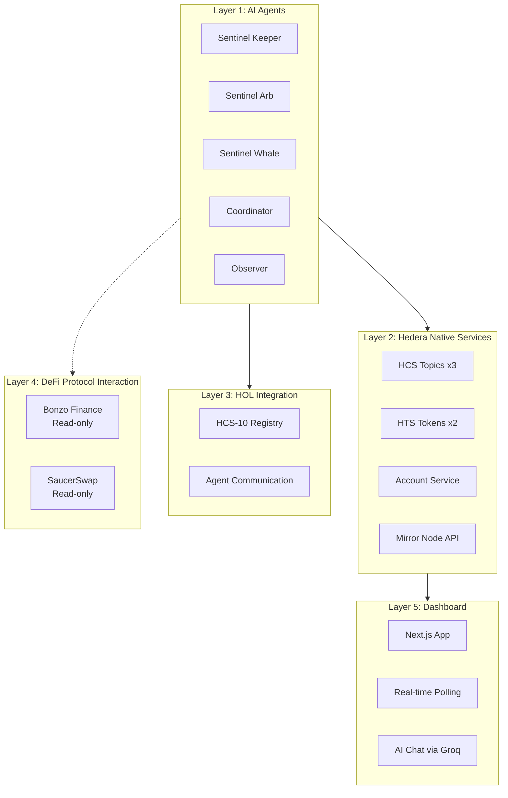
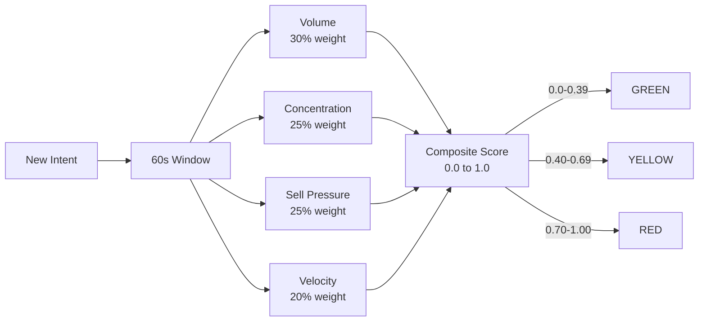
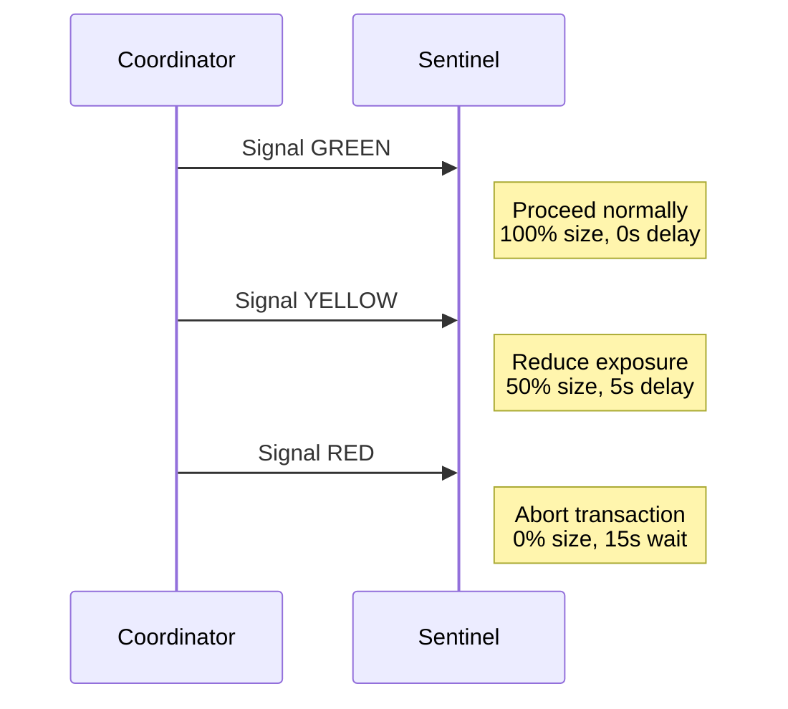
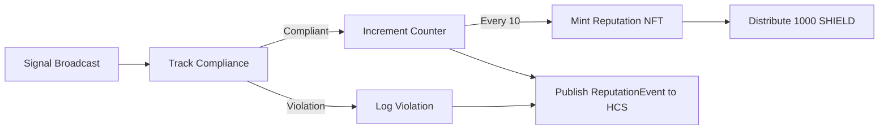
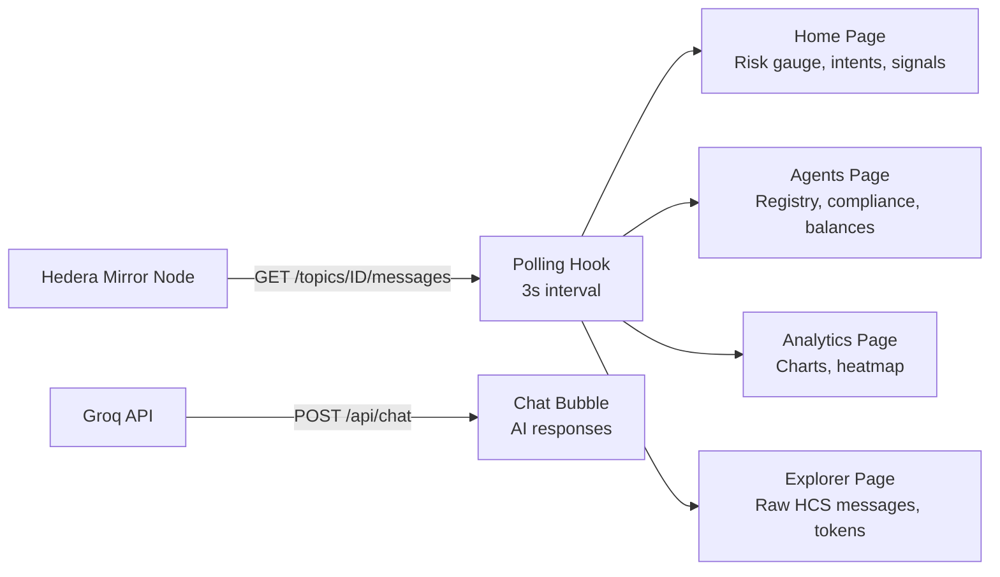

# Architecture

## System Overview

AgentShield operates as a five-layer stack. No custom smart contracts are deployed. All on-chain logic uses Hedera native services.

## Agent Types

| Agent | Count | Purpose | Autonomy |
|-------|-------|---------|----------|
| Coordinator | 1 | Aggregates intents, calculates risk, broadcasts signals, mints reputation NFTs | Autonomous |
| Sentinel Keeper | 1 | Simulates liquidation bot. Publishes intent before executing. Complies with signals. | Autonomous |
| Sentinel Arb | 1 | Simulates arbitrage bot. Publishes swap intents. Adjusts size based on signals. | Autonomous |
| Sentinel Whale | 1 | Simulates large position mover. Publishes large transfer intents. | Autonomous |
| Observer | 1 | Accepts natural language queries via HCS-10. Returns current risk status. | Manual |

## Risk Engine

The Coordinator maintains a sliding 60-second window of all received intents. On each new intent, it recalculates four metrics:

The score is passed to Groq LLM (llama-3.3-70b-versatile) for natural language reasoning, then broadcast as a signal.

## Signal Compliance

Compliance is tracked per agent. Every 10 compliant actions triggers a Reputation NFT mint and 1000 SHIELD token reward.

## Reputation System

## HCS Topic Architecture

| Topic | Submit Key | Content | Frequency |
|-------|-----------|---------|-----------|
| Intent | Public (any agent) | Transaction intents with action, asset, size, direction, urgency | Every 3-45 seconds per agent |
| Signal | Coordinator private key | Risk level, score, reasoning, metrics, recommended delay | On risk level change or threshold |
| Reputation | Coordinator private key | Compliance events, trust scores | After each signal broadcast |

## Dashboard Architecture

The dashboard is a Next.js application that reads exclusively from Hedera Mirror Node REST API. No backend database.

